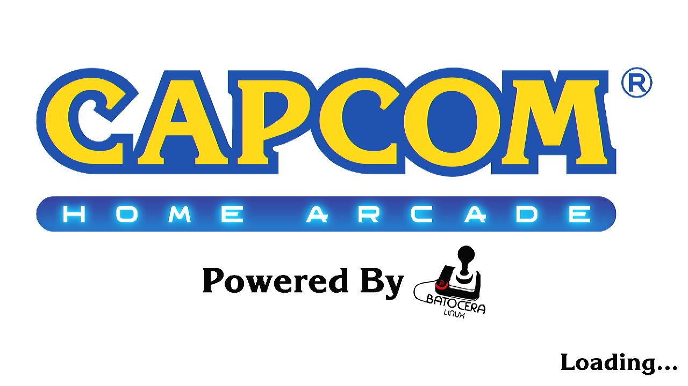
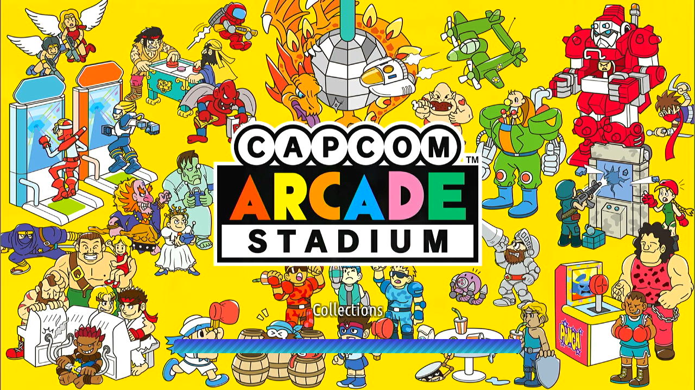
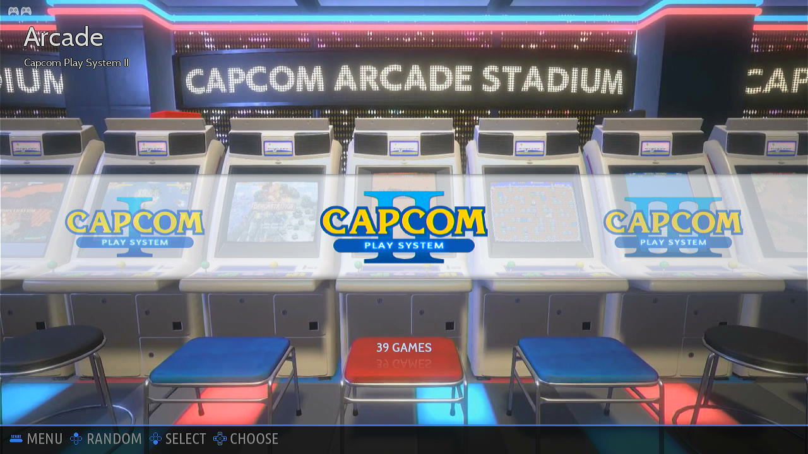
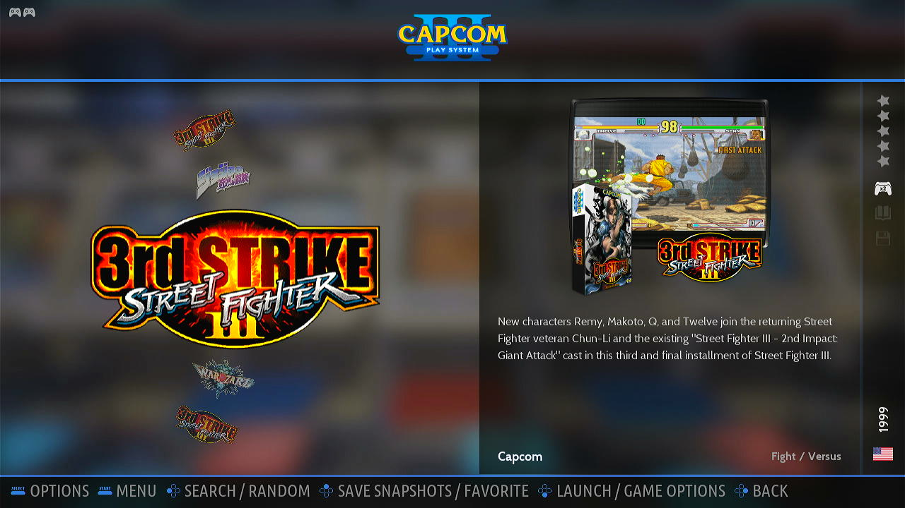
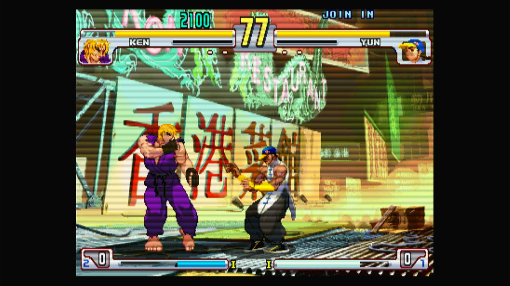
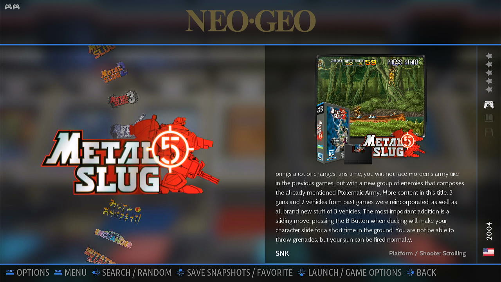
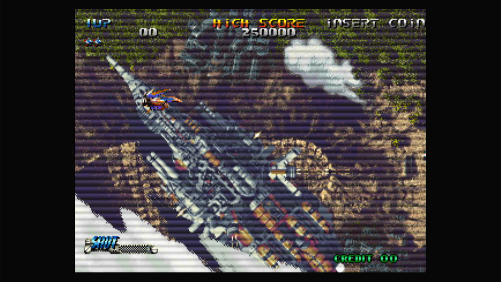

# Batocera by Lilo for Capcom Home Arcade

# Goal of this repository
This repository exists to help build a Batocera image for Capcom Home Arcade (CHA from now on).

This image can fit on EMMC and fit all CPS1, CPS2, CPS3 and NEO GEO games.

To archive this games are supposed to be compressed using 7zip, repeated games have been removed and probably 3-4 unremarkable games too, to fit on EMMC.

Additionally the batocera image has been customised removing other cores and unused media to make additional space.

All games should run at 60 FPS without input lag or sound issues with and without the scanlines shader at 720p.

# How to use the release
1. Burn the image to emmc.
2. Using FEL mode under linux since the SHARE partition is ext4.
- Substitute the dummy 0kb neogeo.zip bios file on the SHARE/bios directory.
- Substitute the dummy 0kb rom.7z files on the SHARE/roms directory.
3. Delete the games you don't have to get shorter lists.

The current release uses FBNeo 1.0.0.2 romset.

NOTE: During the first start Batocera does the setup. Is recomended to restart before playing games.

# How to use the sources
The scripts should be self explanatory for someone that can:
- Enable CHA FEL mode an has installed mods on the past.
- Minimal Experience building batocera (linux required), the scripts should do the difficult parts.

# Special Acknowledgments
- [CHOKO Group](https://github.com/ChokoGroup). They where the first ones to open the CHA development opportunities to a wider audience and put together the package to enable FEL mode. They also wrote the first beginner friendly guide to use it.
- [Batocera Team](https://batocera.org). Demetris in particular for taking over the port of Batocera for the CHA and answer many questions.
- [Koch Media](https://capcomhomearcade.com). For creating a good licensed product and supporting its Reddit community.
